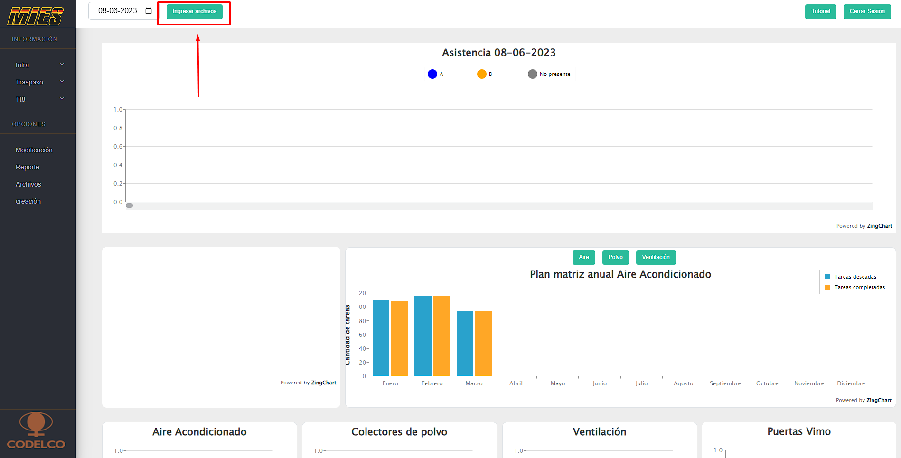

# Sistema web para ingresar, transformar y visualizar datos de procesos del sector minero

Sistema web desarrollado para recibir datos de procesos a través de archivos excel, estos datos son almacenados en la base de datos para posterior análisis y creación de los gráficos correspondientes a los datos ingresados.

## Tecnologías utilizadas

- Node js
- Express js
- Angular js
- Mysql

## Diagrama de flujo del sistema

- Este sistema utiliza AngularJS en el front-end para crear una interfaz dinámica, mientras que Node.js con Express gestiona el back-end, conectándose a una base de datos MySQL. Además, emplea bibliotecas de gráficos como es zingchartjs para visualizar datos obtenidos de MySQL, permitiendo una representación gráfica de la información almacenada.

## Imágenes de muestra

- Panel principal del sistema web, en la parte izquierda existe un menú de opciones para diferentes secciones del sistema

- Panel para ingresar archivos al sistema

- Algunos gráficos que son ilustrados en el sistema

    

